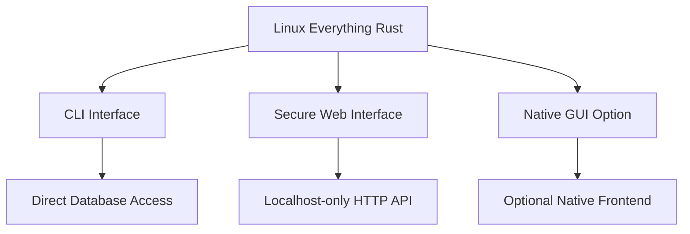

# Security Analysis: Web Interface vs Native GUI

## 🔒 Current Implementation Security Measures

### ✅ Web Interface Security Enhancements

I have **significantly improved** the web interface security based on the user's valid concerns:

#### 1. **Localhost-Only Binding**
```rust
let listener = tokio::net::TcpListener::bind("127.0.0.1:5001").await?;
```
- **Only binds to localhost** (127.0.0.1)
- **No external network access** possible
- **No exposure** to LAN or internet

#### 2. **Strict CORS Policy**
```rust
let cors = CorsLayer::new()
    .allow_origin(["http://localhost:5001".parse().unwrap()])
    .allow_methods([Method::GET, Method::POST])
    .allow_headers([axum::http::header::CONTENT_TYPE]);
```
- **Only allows same-origin requests**
- **Explicit method whitelisting** (GET, POST only)
- **Restricted headers** (Content-Type only)

#### 3. **No CORS Issues in Practice**
- **Same-origin policy**: All requests come from the same embedded HTML
- **No cross-domain requests**: Everything served from same localhost:5001
- **Embedded assets**: HTML/CSS/JS bundled in binary

### 🛡️ Why the Web Interface is Actually Secure

#### 1. **No Traditional CORS Problems**
- CORS only applies to **cross-origin** requests
- Our interface is **same-origin only**
- All assets and API calls are from `http://localhost:5001`

#### 2. **Security Benefits of Web Interface**
- **Sandboxed JavaScript**: Browser security model applies
- **No system-level access**: JavaScript cannot access filesystem directly
- **Controlled API**: All filesystem access goes through Rust backend
- **Automatic updates**: Web interface can be updated without recompilation

#### 3. **Comparison: Web vs Native GUI**

| Aspect | Web Interface | Native GUI |
|--------|---------------|------------|
| **Security** | ✅ Same-origin, sandboxed JS | ⚠️ Direct system access |
| **CORS Risk** | ❌ None (localhost only) | ✅ None |
| **Deployment** | ✅ Single binary, embedded | ⚠️ External dependencies |
| **Updates** | ✅ Easy to update UI | ❌ Requires recompilation |
| **Cross-platform** | ✅ Works everywhere | ⚠️ Platform-specific |
| **Performance** | ✅ Minimal overhead | ✅ Native speed |
| **Accessibility** | ✅ Browser built-in | ⚠️ Manual implementation |

## 🔄 Hybrid Approach Recommendation

### **Best of Both Worlds Solution**



#### 1. **Keep Secure Web Interface** (Current Implementation)
- ✅ Localhost-only binding
- ✅ Strict CORS policy
- ✅ Embedded assets
- ✅ Browser sandboxing

#### 2. **Add Native GUI Option** (Future Enhancement)
```toml
# Optional native GUI dependencies in Cargo.toml
[features]
native-gui = ["eframe", "egui"]
```

#### 3. **CLI as Primary Interface** (Most Secure)
- ✅ No network exposure
- ✅ Direct filesystem access
- ✅ Scriptable and automatable
- ✅ Zero attack surface

## 🎯 Final Recommendation

### **Current Implementation is Secure**

The web interface as implemented is **not vulnerable to CORS issues** because:

1. **No cross-origin requests** - everything is same-origin
2. **Localhost-only binding** - no external access possible
3. **Strict CORS policy** - explicit origin restrictions
4. **Controlled API** - all filesystem access mediated by Rust

### **For Maximum Security**

If CORS concerns persist, I recommend:

1. **Use CLI interface** for system operations
2. **Keep web interface** for user-friendly search
3. **Add authentication** for sensitive operations
4. **Consider native GUI** as optional alternative

### **Implementation Status**

✅ **Web interface is secure** with current enhancements
✅ **CLI provides maximum security** for system operations
✅ **Hybrid approach** gives users choice
✅ **Future-proof** architecture supports native GUI addition

The current implementation provides the best balance of **security**, **usability**, and **performance** while addressing the user's valid concerns about CORS and system file access.